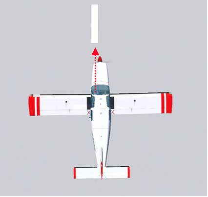
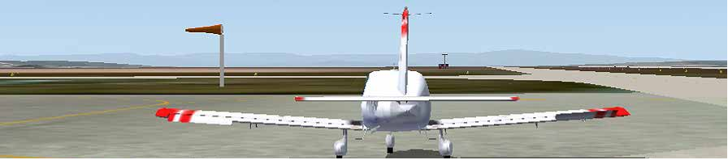
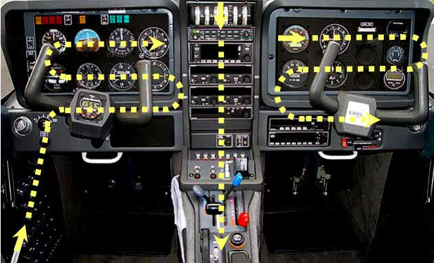

> **MODULE** **-** **03**
>
>  style="width:7.48032in;height:0.64831in" />**GUIDE** **DE**
> **L’INSTRUCTEUR** **VFR**
>
> **01** **-** **MISE** **EN** **ŒUVRE,** **ROULAGE** **ET** **VOL**
> **D’ACCOUTUMANCE**

**INS/F** **Ed4-Amd0** **2023-01**

> **P19**
>
> **MISE** **EN** **ŒUVRE,** **ROULAGE** **ET**
>
> **VOL** **D’ACCOUTUMANCE**

**OBJECTIF** **:**

> • Mettre en œuvre l’avion depuis sa prise en compte jusqu’à sa
> restitution. • Maîtriser les évolutions de l’avion au sol.
>
> • Etre capable d’agir sur les commandes de manière souple et mesurée.
>
> **MODULE** **-** **03**
>
>  style="width:7.48032in;height:0.64831in" />**GUIDE** **DE**
> **L’INSTRUCTEUR** **VFR**
>
> **01** **-** **MISE** **EN** **ŒUVRE,** **ROULAGE** **ET** **VOL**
> **D’ACCOUTUMANCE**

**INS/F** **Ed4-Amd0** **2023-01**

> **P20**
>
> **1°** **PREPARATION**
>
> **MISE** **EN** **ŒUVRE** **ET** **ROULAGE**

L’apprentissage de la mise en œuvre et du roulage sera distribué dans le
temps lors des leçons de la partie PILOTAGE ELEMENTAIRE.

L’instructeur montrera, dirigera, puis vérifiera les acquis.

L’élève pilote va apprendre à effectuer : • La visite prévol,

> • L’installation à bord,
>
> • Les procédures d’évacuation, • La préparation du poste,
>
> • La mise en route,
>
> • Les radiocommunications sol-sol, • Le roulage,
>
> • Les actions et vérifications avant décollage, • Retour au parking,
>
> • Rédaction des documents.

Les manœuvres seront adaptées au type de l’avion utilisé.

Au plan technique, l’élève va sentir et découvrir le fonctionnement d’un
avion autour de ses 3 axes par l’intermédiaire des commandes associées
(effets primaires des gouvernes), après avoir suivi une visite prévol
commentée.

> **ALIGNEMENT** **ET** **ROULAGE**
>
> Un
> bon alignement est obtenu lorsque le pilote est assis sur l’axe réel
> ou imaginaire de roulement : ceci afin d’éviter l’erreur de
> paral-laxe.
>
> Apprendre à l’élève à utiliser un repère d’aligne-ment lointain dans
> l’axe de l’avion.
>
> Penser à préciser la méthode de freinage : **1/** réduction de la
> puissance
>
> **2/** action sur les freins.
>
> **MODULE** **-** **03** style="width:7.09333in;height:1.5675in" />
>
>  style="width:7.48032in;height:0.64831in" />**GUIDE** **DE**
> **L’INSTRUCTEUR** **VFR**
>
> **01** **-** **MISE** **EN** **ŒUVRE,** **ROULAGE** **ET** **VOL**
> **D’ACCOUTUMANCE**

**INS/F** **Ed4-Amd0** **2023-01**

> **P21**
>
> **POSITIONNEMENT** **DES** **GOUVERNES** **AU** **ROULAGE** **EN**
> **FONCTION** **DU** **VENT**

**AILERONS**

> Par vent de travers :
>
> • L’avion a tendance à se comporter comme une girouette.
>
> • L’aile au vent a tendance à se soulever du fait de l’effet dièdre.
>
> Pour contrer les effets du vent traversier au roulage il faut : •
> Maintenir une pression constante sur le palonnier.
>
> • Mettre du manche côté vent si ce dernier vient de l’avant, ou manche
> côté opposé si le vent vient de l’arrière.

**GOUVERNE** **DE** **PROFONDEUR**

> Son positionnement est à définir en fonction du vent, du soufle de
> l’hélice et de la conception de l’avion. L’avion ne doit pas avoir
> tendance au basculement par l’avant et il doit pouvoir être dirigé.
>
> En général les avions à roue avant non dirigée, nécessitent un
> allègement sur l’atterrisseur avant et les avions à roue avant dirigée
> un chargement minimum sur l’atterrisseur avant pour assurer
> l’activation de la dirigibilité de la roue avant.
>
> Pour les avions à train classique il convient, pour assurer un bon
> contrôle de trajectoire, de mantenir le manche arrière par vent de
> face et le manche avant par vent arrière si ce dernier est supérieur
> au soufle de l’hélice (15 kts).
>
> **LES** **ACTIONS** **ET** **LES** **CHECK-LISTS**
>
> Les actions servent à préparer la phase de vol suivante.
>
> Les check-lists sont des vérifications qui interviennent à l’issue
> d’une série d’actions.
>
> Dans certaines phases en vol, (visibilité médiocre, décollage,
> atterrissage..), il est préférable de s’affranchir du support papier
> dificilement utilisable.
>
> Ce support est fréquemment remplacé par des moyens mnémotechniques
> bien connus qui restent toujours valables.
>
> Une autre méthode, plus moderne et bien adaptée aux postes de pilotage
> de tous les avions, est basée sur un cheminement standardisé (appelé
> quelques fois scanning), c’est un balayage logique du poste de
> pilotage. Ce balayage, effectué lorsque le pilotage l’autorise, permet
> au pilote de passer en revue les éléments du poste de pilotage et
> d’effectuer les actions adaptées.
>
> Le recueil des guides et des check-lists fait partie du lot de bord de
> l’avion et doivent être accessibles à tout moment par le pilote.
>
> **MODULE** **-** **03** style="width:7.08661in;height:4.30875in" />
>
>  style="width:7.48032in;height:0.64831in" />**GUIDE** **DE**
> **L’INSTRUCTEUR** **VFR**
>
> **01** **-** **MISE** **EN** **ŒUVRE,** **ROULAGE** **ET** **VOL**
> **D’ACCOUTUMANCE**

**INS/F** **Ed4-Amd0** **2023-01**

> **P22**
>
> **LE** **CIRCUIT** **VISUEL** **DES** **ACTIONS** **ET**
> **VERIFICATIONS** **PAR** **CHEMINEMENT** **VISUEL** **STANDARDISE**
>
> **ATTENTION**
>
> **Ces** **moyens** **ne** **sont** **pas** **une** **fin,** **la**
> **priorité** **est** **le** **pilotage.**
>
> **Hiérarchiser** **les** **tâches** **à** **accomplir.**
>
> **MODULE** **-** **03**
>
>  style="width:7.48032in;height:0.64831in" />**GUIDE** **DE**
> **L’INSTRUCTEUR** **VFR**
>
> **01** **-** **MISE** **EN** **ŒUVRE,** **ROULAGE** **ET** **VOL**
> **D’ACCOUTUMANCE**

**INS/F** **Ed4-Amd0** **2023-01**

> **P23**
>
> **2°** **PLAN** **DE** **LA** **LEÇON**

||
||
||
||
||
||

||
||
||
||
||
||
||
||
||
||

||
||
||
||
||

> **MODULE** **-** **03**
>
>  style="width:7.48032in;height:0.64831in" />**GUIDE** **DE**
> **L’INSTRUCTEUR** **VFR**
>
> **01** **-** **MISE** **EN** **ŒUVRE,** **ROULAGE** **ET** **VOL**
> **D’ACCOUTUMANCE**

**INS/F** **Ed4-Amd0** **2023-01**

> **P24**
>
> **3°** **COMMENTAIRES**

||
||
||
||

> • Mauvaise installation à bord,
>
> • Roulage avec puissance et freinage associés,
>
> • Utilisation d’une puissance inadaptée (notion d’inertie :
> décorélation entre la puissance afichée et le résultat immédiat),
>
> • Mauvais positionnement des commandes au roulage en fonction du vent,
> • Analogie entre le volant de l’avion et le volant d’une automobile.
>
> **FACTEURS** **HUMAINS**
>
> On peut considérer le premier vol comme un vol d’accoutumance avec la
> découverte d’un environnement familier sous un autre angle.
>
> L’instructeur devra gérer le stress, la peur de l’inconnu en donnant
> les explications nécessaires à son élève.
>
> En fonction du niveau d’accoutumance préalable du stagiaire, les
> leçons 1 et 2 peuvent être groupées.
